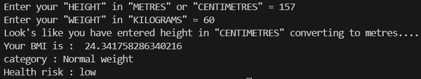

# ⚖️ BMI Calculator – Python Project

This Python project calculates a user's **Body Mass Index (BMI)** using the height and weight provided by the user. It then classifies the BMI into categories such as **underweight**, **normal**, **overweight**, and various **obesity levels**, along with the associated health risks.

---

## 💡 What It Does

- Takes user input for height (in metres or centimetres) and weight (in kilograms)
- Automatically converts height from cm to m if needed
- Validates inputs to ensure positive values
- Displays:
  - Calculated BMI value
  - BMI classification (e.g., Normal, Overweight, Obesity Class I, etc.)
  - Associated health risk

---

## 🖼️ Output Screenshot

---

## ▶️ How to Run

1. Make sure Python is installed on your system (Python 3.6+ recommended).  
2. Save the code in a `.py` file (e.g., `bmi_calculator.py`).  
3. Run the program in your terminal or any Python IDE.

---

## 📊 BMI Categories & Health Risks

| BMI Range         | Category              | Health Risk        |
|-------------------|------------------------|---------------------|
| < 16              | Severe Underweight     | Very High           |
| 16 – 16.9         | Moderate Underweight   | High                |
| 17 – 18.4         | Mild Underweight       | Elevated            |
| 18.5 – 24.9       | Normal Weight          | Low                 |
| 25 – 29.9         | Overweight             | Increased           |
| 30 – 34.9         | Obesity Class I        | High                |
| 35 – 39.9         | Obesity Class II       | Very High           |
| 40 and above      | Obesity Class III      | Extremely High      |

---

## 👤 Author

**Kshitij Bokde**  
🌐 GitHub: [kshitijB01](https://github.com/kshitijB01)  
📧 Email: [kshitijliladharbokde@gmail.com](mailto:kshitijliladharbokde@gmail.com)

---

Feel free to improve the code, add a GUI version, or link it to health databases for deeper analysis!

