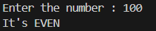

# 🔢 Even or Odd Checker – Python Project

This is a simple Python program that takes a number as input from the user and checks whether it is **even** or **odd**.

---

## 💡 What It Does

- Prompts the user to input a number
- Checks if the number is divisible by 2
- Displays whether the number is even or odd

---

## 🖼️ Output Screenshot

---

## ▶️ How to Run

1. Make sure Python is installed on your system (Python 3.6+ recommended)  
2. Save the code in a `.py` file (e.g., `even_odd_checker.py`)  
3. Run the program using your terminal or IDE

---

## 🧠 Logic Used

A number is:
- **Even** if the remainder when divided by 2 is 0 (`number % 2 == 0`)
- **Odd** otherwise

Note: The current version takes **floating-point numbers**, which may lead to unexpected results for non-integer inputs. You can modify it to restrict input to integers only for stricter checking.

---

## 👤 Author

**Kshitij Bokde**  
🌐 GitHub: [kshitijB01](https://github.com/kshitijB01)  
📧 Email: [kshitijliladharbokde@gmail.com](mailto:kshitijliladharbokde@gmail.com)

---

Feel free to improve this program by adding input validation or extending it to handle multiple inputs!

