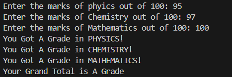

# 📝 Subject-wise Grade Calculator – Python Project

This Python program allows users to input marks for **Physics**, **Chemistry**, and **Mathematics**, and then calculates both:

- **Subject-wise grades**
- **Overall grade** based on the total score out of 300

---

## 💡 What It Does

- Takes input marks (out of 100) for:
  - Physics
  - Chemistry
  - Mathematics
- Assigns grades for each subject:
  - A (91–100)
  - B (81–90)
  - C (71–80)
  - D (Below 71)
- Calculates total marks and gives an overall grade:
  - A (291–300)
  - B (281–290)
  - C (271–280)
  - D (Below 271)

---

## 🖼️ Output Screenshot

---

## ▶️ How to Run

1. Make sure Python is installed on your system (Python 3.6+ recommended)  
2. Save the code in a `.py` file (e.g., `grade_calculator.py`)  
3. Run the program in your terminal or any Python IDE

---

## 🎓 Grading System Used

### Subject-wise Grades:
| Marks Range | Grade |
|-------------|--------|
| 91 – 100    | A      |
| 81 – 90     | B      |
| 71 – 80     | C      |
| Below 71    | D      |

### Grand Total Grades:
| Total Marks | Grade |
|-------------|--------|
| 291 – 300   | A      |
| 281 – 290   | B      |
| 271 – 280   | C      |
| Below 271   | D      |

---

## ⚠️ Note

- The program assumes valid numeric input.
- You can extend this by:
  - Adding validation to ensure inputs are between 0 and 100
  - Accepting more subjects
  - Adding percentage calculation

---

## 👤 Author

**Kshitij Bokde**  
🌐 GitHub: [kshitijB01](https://github.com/kshitijB01)  
📧 Email: [kshitijliladharbokde@gmail.com](mailto:kshitijliladharbokde@gmail.com)

---

Feel free to use, improve, or extend this project for school systems or student report generators!

