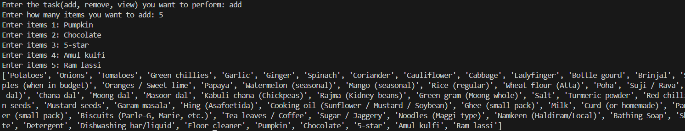
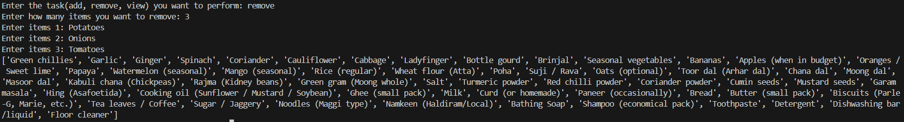
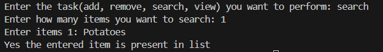

# 🛒 Grocery List Manager – Python Project

This Python project is a simple **Grocery List Manager** that allows users to **add, remove, and view grocery items**.  
It demonstrates basic Python concepts such as lists, loops, conditionals, and user input.

---

## 💡 What It Does

- Maintains a **default grocery list** with common household items  
- Allows the user to:
  - **Add** new items to the list  
  - **Remove** items from the list  
  - **View** the current grocery list  
- Handles cases where the item to be removed does not exist  

---

## 🖼️ Output Screenshots

**Add Items:**  

**Remove Items:**  

**Search Items:**  

---

## ▶️ How to Run

1. Make sure Python is installed on your system (Python 3.6+ recommended).  
2. Save the code in a file named `grocery_list_manager.py`.  
3. Run the program in your terminal or Python IDE.  
4. Choose a task (`add`, `remove`, `view`) when prompted.  

---

## 👤 Author

**Kshitij Bokde**  
🌐 GitHub: [kshitijB01](https://github.com/kshitijB01)  
📧 Email: [kshitijliladharbokde@gmail.com](mailto:kshitijliladharbokde@gmail.com)

---

