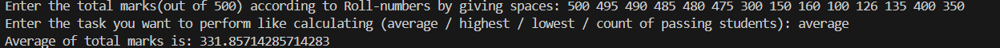
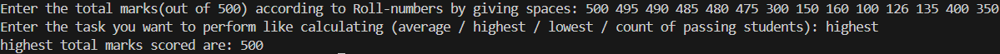
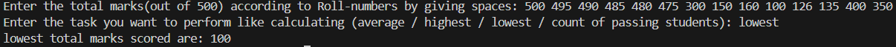
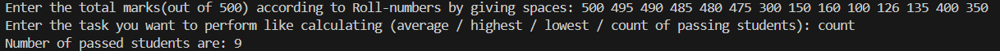

# 🎓 Student Marks Analyzer – Python Project

This Python project allows users to input **marks of students** and then perform different operations such as calculating **average, highest, lowest, and count of passing students**.  
It demonstrates concepts of **lists, loops, conditionals, and mathematical operations** in Python.

---

## 💡 What It Does

- Accepts a list of student marks (out of 500) entered by the user  
- Allows the user to choose a task:
  - **Average** → Calculates the average marks of all students  
  - **Highest** → Finds the highest marks scored  
  - **Lowest** → Finds the lowest marks scored  
  - **Count** → Counts the number of students who passed (marks ≥ 175)  
- Handles multiple roll numbers at once  

---

## 🖼️ Output Screenshots

- **Average Calculation**  
  

- **Highest Marks**  
  

- **Lowest Marks**  
  

- **Count of Passing Students**  
  

---

## ▶️ How to Run

1. Make sure Python is installed on your system (Python 3.6+ recommended).  
2. Save the code in a file named `student_marks_analyzer.py`.  
3. Run the program in your terminal or Python IDE.  
4. Enter student marks separated by spaces.  
5. Choose a task (`average`, `highest`, `lowest`, or `count`).  

---

## 👤 Author

**Kshitij Bokde**  
🌐 GitHub: [kshitijB01](https://github.com/kshitijB01)  
📧 Email: [kshitijliladharbokde@gmail.com](mailto:kshitijliladharbokde@gmail.com)

---

