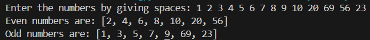

# 🔢 Odd and Even Number Separator – Python Project

This Python project takes a **list of numbers as input from the user** and separates them into **even** and **odd numbers**.  
It demonstrates basic Python concepts such as **lists, loops, conditionals, and user input handling**.

---

## 💡 What It Does

- Accepts a list of numbers entered by the user (separated by spaces)  
- Separates the numbers into:
  - **Even Numbers**
  - **Odd Numbers**  
- Displays the categorized lists  

---

## 🖼️ Output Screenshot

---

## ▶️ How to Run

1. Make sure Python is installed on your system (Python 3.6+ recommended).  
2. Save the code in a file named `odd_even_separator.py`.  
3. Run the program in your terminal or Python IDE.  
4. Enter numbers separated by spaces when prompted.  

---

## 👤 Author

**Kshitij Bokde**  
🌐 GitHub: [kshitijB01](https://github.com/kshitijB01)  
📧 Email: [kshitijliladharbokde@gmail.com](mailto:kshitijliladharbokde@gmail.com)

---

