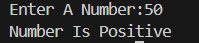

# 🔢 Number Sign Checker – Python Project

This is a beginner-friendly Python program that takes an integer input from the user and checks whether the number is **positive**, **negative**, or **zero**.

---

## 💡 What It Does

The script performs the following actions:

1. Prompts the user to enter an integer.
2. Checks whether the number is:
   - Positive
   - Negative
   - Zero
3. Prints the result accordingly.

---

## 🖼️ Output Screenshot

---

## ▶️ How to Run

1. Make sure Python is installed on your system (Python 3.6+ recommended).  
2. Save the code in a `.py` file (e.g., `number_sign_checker.py`).

---

## 👤 Author

**Kshitij Bokde**  
🌐 GitHub: [kshitijB01](https://github.com/kshitijB01)  
📧 Email: [kshitijliladharbokde@gmail.com](mailto:kshitijliladharbokde@gmail.com)

---

Feel free to use or modify this code in your own learning or projects!
