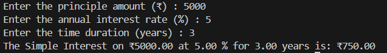

# 💰 Simple Interest Calculator – Python Project

This Python program calculates **Simple Interest** based on user input for **Principal Amount**, **Annual Interest Rate**, and **Time in Years**. It's ideal for beginners practicing user input, arithmetic operations, and formatted output in Python.

---

## 💡 What It Does

- Takes user input for:
  - Principal (₹)
  - Rate of Interest (%)
  - Time (years)
- Calculates the simple interest
- Displays the result with formatted output

---

## 🖼️ Output Screenshot

---

## ▶️ How to Run

1. Make sure Python is installed on your system (Python 3.6+ or later)  
2. Save the code in a file (e.g., `simple_interest_calculator.py`)  
3. Run the script in your terminal or preferred Python IDE

---

## 👤 Author

**Kshitij Bokde**  
🌐 GitHub: [kshitijB01](https://github.com/kshitijB01)  
📧 Email: [kshitijliladharbokde@gmail.com](mailto:kshitijliladharbokde@gmail.com)

---

Feel free to extend this project by adding compound interest, monthly interest breakdowns, or a GUI!

