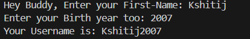

# 🧩 Username Generator – Python Project

This Python project generates a **username** by combining the user's **first name** and **birth year**.  
It is a beginner-friendly project that demonstrates **user input**, **string concatenation**, and **basic Python programming concepts**.

---

## 💡 What It Does

- Takes user input for **first name** and **birth year**  
- Concatenates them to generate a unique username  
- Displays the generated username to the user  

---

## 🖼️ Output Screenshot



---

## ▶️ How to Run

1. Make sure Python is installed on your system (Python 3.6+ recommended).  
2. Save the code in a file named `username_generator.py`.  
3. Run the program in your terminal or any Python IDE:  
   ```bash
   python username_generator.py

---

## 👤 Author

**Kshitij Bokde**  
🌐 GitHub: [kshitijB01](https://github.com/kshitijB01)  
📧 Email: [kshitijliladharbokde@gmail.com](mailto:kshitijliladharbokde@gmail.com)

---

Feel free to improve the code, add a GUI version, or link it to health databases for deeper analysis!
