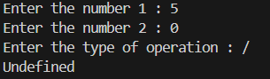
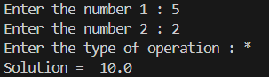

# 🧮 Simple Calculator – Python Project

This is a basic Python calculator that performs four fundamental operations: **Addition**, **Subtraction**, **Multiplication**, and **Division**. It's designed for beginners to practice user input and conditional statements.

---

## 💡 What It Does

- Accepts two numeric inputs from the user  
- Asks for the type of operation (`+`, `-`, `*`, `/`)  
- Performs the selected operation and displays the result  
- Informs the user if the operation is undefined or unsupported  

---

## 🖼️ Output Screenshots

### ➤ Example 1:   

### ➤ Example 2: 

---

## ▶️ How to Run

1. Make sure Python is installed on your system (Python 3.6+ or later)  
2. Save the code in a file (e.g., `simple_calculator.py`)  
3. Open a terminal or Python IDE and run the program  

---

## 🔢 Supported Operations

| Operation     | Symbol |
|---------------|--------|
| Addition      | `+`    |
| Subtraction   | `-`    |
| Multiplication| `*`    |
| Division      | `/`    |

---

## 👤 Author

**Kshitij Bokde**  
🌐 GitHub: [kshitijB01](https://github.com/kshitijB01)  
📧 Email: [kshitijliladharbokde@gmail.com](mailto:kshitijliladharbokde@gmail.com)

---

Feel free to use, modify, and expand this calculator to include more advanced operations like modulus, exponentiation, or square root.
